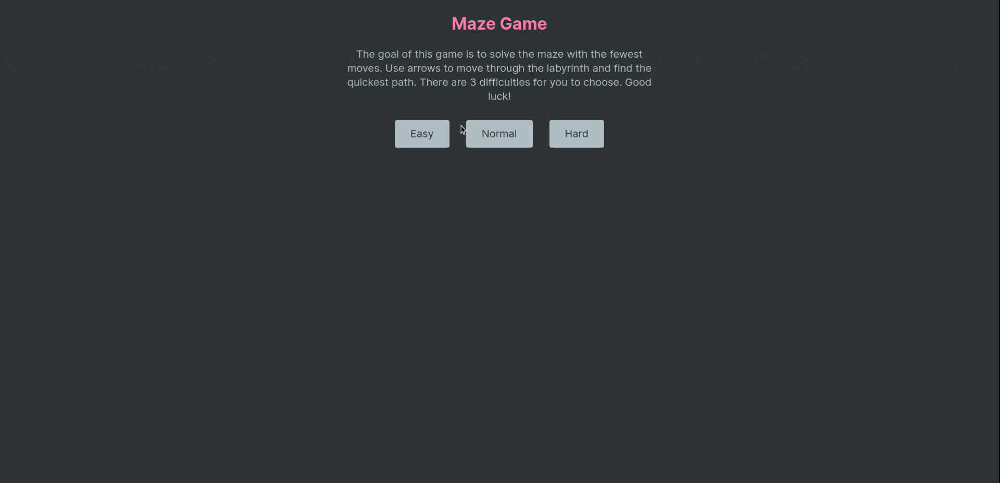

# Maze Game

This is a simple maze solving game made in React.js. That was the first thing that I made while learning it. Since then,
I rewrote it from scratch :)

## Live version

You can check out the game [here](https://maze-game-pawelblaszczyk.netlify.app/).

## Run it locally

- Clone repo
- Run `npm ci`
- Run `npm run dev`

## Functionalities

- Generating random maze using recursive backtracking algorithm
- Finding shortest path using A* algorithm (you can preview the path by using cheat code and writing 'cheater' at any
  point of the game)
- Three difficulties
- Result based on comparing yours move count and shortest possible

## Feedback

Any feedback is appreciated. Feel free to head me up.

## License

[MIT](https://choosealicense.com/licenses/mit/)
